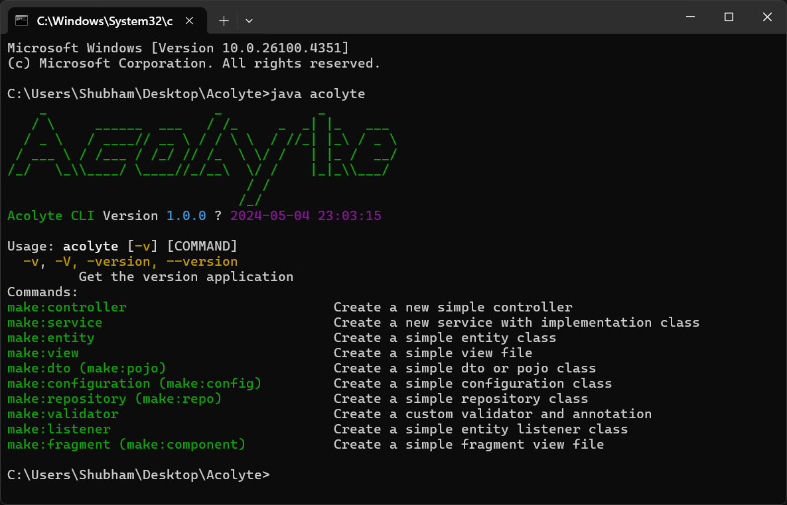

# Acolyte
A command line tool for spring boot application, which make your effort a lot easier by writing boilerplate code for you and also maintain the standard spring package structure.
<br/><br/>

<h3 align="center">🛠 <span style="color: orange">Under development...</span></h3>
<br/><br/>

<div style="display: flex;flex-direction: column; grid-gap: 10px;">
   <div style="display: flex; grid-gap: 10px;">
        
    </div>
</div>


## Commands

#### Make Entity
```shell
acoltye make:entity <Entity-Name>
```
```shell
acoltye make:entity User
```

#### Make View
```shell
acolyte make:view <View-Name>
```
```shell
acolyte make:view user-list
```

#### Make Controller
```shell
acolyte make:controller <Controller-Name> --resource <function-names>
```
```shell
acolyte make:controller UserController 
```
```shell
acolyte make:controller UserController --resource
```
```shell
acolyte make:controller UserController --resource index save destroy
```
#### Make DTO or POJO
```shell
acolyte make:dto <dto-name>
```
```shell
acolyte make:dto UserDto
```
#### Make Service
```shell
acolyte make:service <service-name>
```
```shell
acolyte make:service UserSerivce
```
#### Make Repository
```shell
acolyte make:repository <entity-name>
// OR
acolyte make:repo <entity-name>
```
```shell
acolyte make:repo UserRepository
```
#### Make Configuration
```shell
acolyte make:configuration <config-class-name>
// OR
acolyte make:config <config-class-name>
```
```shell
acolyte make:config WebConfig
```

#### Make Validator
```shell
acolyte make:validator <validator-class-name> --dto=<dto-class-name>
```
```shell
acolyte make:validator UserValidator --dto=UserDto
```

#### Make Listener
```shell
acolyte make:listener <listener-class-name>
```
```shell
acolyte make:listener UserListener
``` 
```java
// use this on your class to apply 
@EntityListeners(UserListener.class)
public class User{
    
}
```